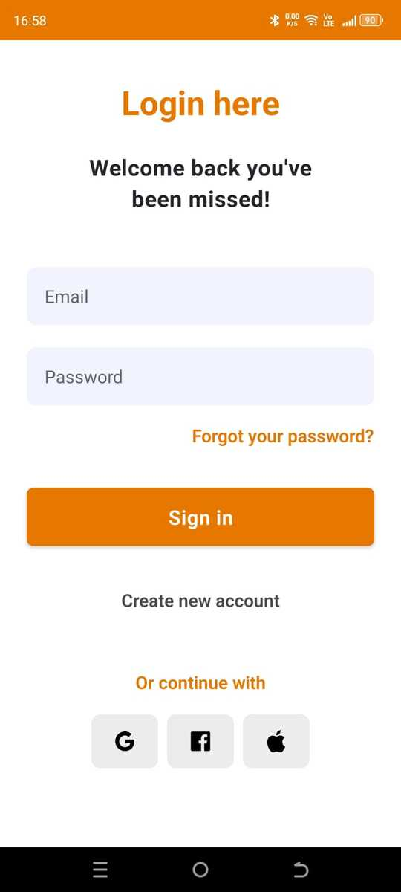
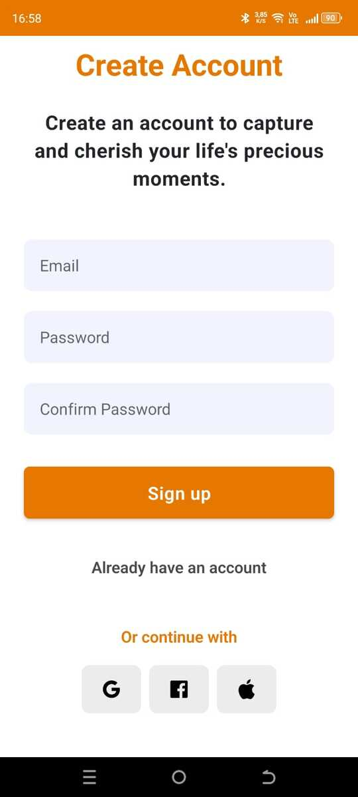
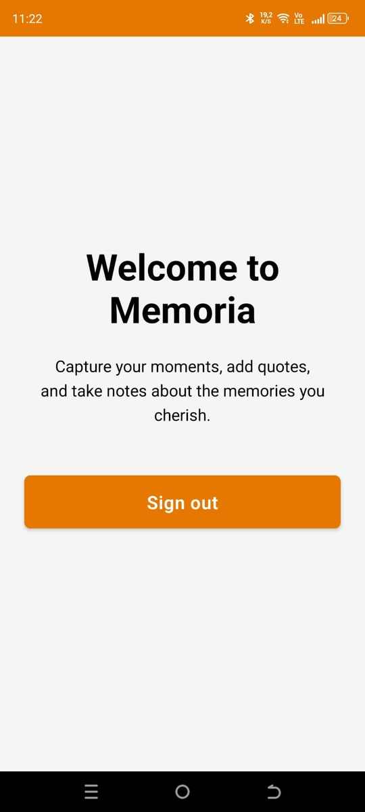

# React Native Onboarding Page

### Tarih: 20.08.2024(salı)

İlerleme: Bugün, giriş sayfası için ana ekranı ekleyip layoutu tamamladım ve tekrar kullanılabilir bir buton bileşeni oluşturdum.


Sonraki Adımlar: Navigation için route ayarlarını yaparken bir TypeScript hatasıyla karşılaştım, bunu çözmem gerekiyor.

Böyle yaptığımda bu hatayı alıyorum:

Argument of type '"/login"' is not assignable to parameter of type 'Href<string | object>'.ts(2345)

```jsx
<Button onPress={() => router.push("/login")}>Login</Button>
```

Editör böyle yapmamı istiyor. Ama böyle de unmatched route hatası alıyorum.

```jsx
<Button
  onPress={() => router.push("/(auth)login")}
  backgroundColor="#f1f3f5"
  textColor="#000"
>
  Login
</Button>
```

### Tarih: 21.08.2024(çarşamba)

İlerleme: Bugün, dün karşılaştığım hatayı uygulamayı yeniden build ederek çözdüm. Ayrıca, React Hook Form ile form validasyonunu tamamladım. Login ve Register sayfalarının layoutunu bitirdim ve kullanıcı eksik bilgi girdiğinde ekranda bu hatayı gösterdim. Yarın bir veritabanına bağlanıp, login ve register işlemlerini halledeceğim.

<p align="center">
  
  
</p>

### Tarih: 22.08.2024(perşembe)

İlerleme: Bugün [supabase](https://supabase.com) ile login, signup ve logout fonksiyonlarını ekledim. Ayrıca, kullanıcı doğrulama süreçlerini tamamladım ve hata yönetimi için gerekli kontrolleri ekledim. Kullanıcı arayüzünde bazı iyileştirmeler yaptım ve performans optimizasyonları gerçekleştirdim.

### Tarih: 23.08.2024 (Cuma)

İlerleme: Bugün protected layout yaptım, authorization ekledim, login ve signup sayfalarına arka plan kalıbı ekledim. Zustand ve AsyncStorage ile sessionları depoladım. Eğer kullanıcı bir sessiona sahip değilse uygulamanın ana ekranını göremiyor.



## Kullandığım kütüphaneler:

State Management: [zustand](https://zustand.docs.pmnd.rs/getting-started/introduction)
Backend & Database: [supabase](https://supabase.com/)
Form management: [react-hook-form](https://react-hook-form.com/)
Form validation: [zod](https://zod.dev/)
Design inspiration: [figma](https://www.figma.com/community/file/1282291722642517542)
